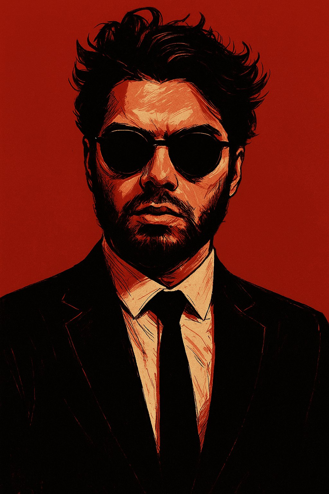

<div align="center">

<!-- HERO SECTION -->


<!-- PROFILE PICTURE + INTRO SIDE BY SIDE -->
<table border="0" cellspacing="0" cellpadding="0">
  <tr>
    <td width="280" align="center" valign="middle">
      <br/>
      
      <br/><br/>
      <!-- Social Badges -->
      <a href="https://www.facebook.com/shahriar.samee">
        
      </a>
      <br/><br/>
      <a href="mailto:shahriar_shafi@outlook.com">
        
      </a>
    </td>
    <td width="30"></td>
    <td valign="middle" align="left">
      <br/>
      <h1>
        
      </h1>
      <br/>
      <p>
        
        &nbsp;
        
      </p>

```
╔══════════════════════════════════════════╗
║  👤  Shahriar Samee                      ║
║  🎯  Professional Cybersecurity Analyst  ║
║  🛡️  Certified Security Professional    ║
║  🌍  Protecting the Digital World       ║
╚══════════════════════════════════════════╝
```

> *"Security is not a product, but a process."*
> — Bruce Schneier

<br/>

**I am a certified cybersecurity professional** specializing in threat detection, vulnerability assessment, incident response, and network security. With deep expertise in both offensive and defensive security, I help organizations identify weaknesses before malicious actors can exploit them.

    </td>
  </tr>
</table>

---

## 🛡️ About Me

```python
class CybersecurityAnalyst:
    name       = "Shahriar Samee"
    role       = "Certified Cybersecurity Analyst"
    location   = "Protecting networks worldwide 🌐"
    
    certifications = [
        "Certified Cybersecurity Professional",
        "Threat Intelligence Analyst",
        "Penetration Testing Specialist",
    ]
    
    specializations = [
        "Threat Hunting & Detection",
        "Vulnerability Assessment & Management",
        "Incident Response & Forensics",
        "Network Security Monitoring",
        "Ethical Hacking & Penetration Testing",
        "SIEM & Log Analysis",
    ]
    
    philosophy = "Defense is only as strong as its weakest link."
```

---

## ⚔️ Core Competencies

<table>
  <tr>
    <td align="center" width="25%">
      
    </td>
    <td align="center" width="25%">
      
    </td>
    <td align="center" width="25%">
      
    </td>
    <td align="center" width="25%">
      
    </td>
  </tr>
</table>

---

## 🧰 Tools & Technologies

### Security Tools


### SIEM & Monitoring


### Programming & Scripting


### Cloud & Infrastructure


---

## 📊 GitHub Stats

<div align="center">
  
  &nbsp;&nbsp;
  
</div>

---

## 🎯 Security Focus Areas

```
Offensive Security     [████████████████░░░] 85%  🗡️
Defensive Security     [████████████████████] 95%  🛡️
Digital Forensics      [███████████████░░░░░] 78%  🔬
Cloud Security         [██████████████░░░░░░] 72%  ☁️
Network Analysis       [████████████████████] 90%  🌐
Malware Analysis       [█████████████░░░░░░░] 70%  🦠
```

---

## 📫 Let's Connect

<div align="center">

| Contact | Link |
|:---|:---|
| 💼 **Facebook** | [facebook.com/shahriar.samee](https://www.facebook.com/shahriar.samee) |
| 📧 **Email** | [shahriar_shafi@outlook.com](mailto:shahriar_shafi@outlook.com) |

<br/>

*"The quieter you become, the more you can hear." — Security Mindset*

</div>

---


</div>
